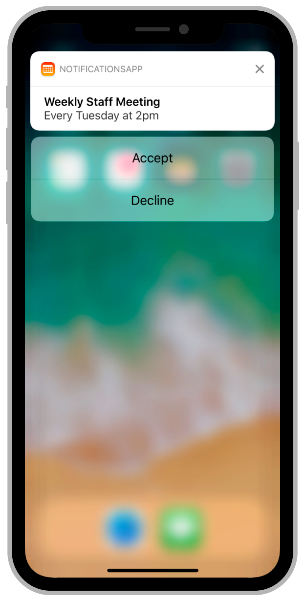

# 通知中心（UNUserNotifications）

## 请求通知权限

> 在App启动时请求授权。
>
> Make your authorization request during your app's launch cycle.

苹果官方文档要求我们把请求权限的代码写在App启动后的相关方法内。

使用[UNUserNotificationCenter](https://developer.apple.com/documentation/usernotifications/unusernotificationcenter)来请求通知权限。`.current()`方法用以获取此类的单例对象。

```swift
let center = UNUserNotificationCenter.current()
// 请求 显示通知，播放通知声音 的权限
center.requestAuthorization(options: [.alert, .sound])  {(granted, error) in
    
}
```

### 检查已请求权限的可用性

用户在第一次请求通知权限之后，后期是可以在系统设置里修改的。用户可以分别控制是否允许你的App开启通知声音，通知横幅，App角标等权限。

检查权限所以使用的相关依赖依然是`UNUserNotificationCenter`。

```swift
let center = UNUserNotificationCenter.current()

center.getNotificationSettings { (settings) in                            
    guard settings.authorizationStatus == .authorized else {return}
    /// 是否被允许在锁屏显示通知,取值enabled/disabled
	settings.lockScreenSetting
	/// 是否允许显示弹窗
	settings.alertSetting
	... 
}
```


## 发送本地通知

推送一个本地通知主要分为以下几步：

1. 创建[`UNMutableNotificationContent`](https://developer.apple.com/documentation/usernotifications/unmutablenotificationcontent)对象，此对象用于描述通知的内容信息，比如标题和消息体。
2. 创建[`UNNotificationTrigger`](https://developer.apple.com/documentation/usernotifications/unnotificationtrigger)对象（可选）。此对象用于指定通知的触发方式，比如具体时间，具体地点，甚至时间周期。
3. 创建[`UNNotificationRequest`](https://developer.apple.com/documentation/usernotifications/unnotificationrequest)对象，此对象用于描述一个通知请求，请求会带上以上创建的两个对象。
4. 提交通知请求

```swift
let notificationContent = UNMutableNotificationContent()
notificationContent.title = "通知标题"
notificationContent.body = "通知内容"

var date = DateComponents()
date.hour = 8
date.minute = 30 
/// 在每天的8:30分，触发此通知
let trigger = UNCalendarNotificationTrigger(dateMatching: date, repeats: true)

/// identitier用于保证request的唯一性，以后可用于取消通知时使用。
/// 如果trigger参数为nil，则此通知立即发出。
let request = UNNotificationRequest(identifier: UUID().uuidString, 
            content: notificationContent, trigger: trigger)

UNUserNotificationCenter.current().add(request) { (error) in 
	if error != nil {
		// pass
	}
}
```


## 定制通知行为

### Actionable notifications




#### 发送一个本地Actionable Notification

```swift
/// identifier是此action的唯一标识符，title就是按钮的标题，options用于指定此按钮的一些行为，比如.authenticationRequired表示必须手机在解锁状态才能显示此按钮
let acceptAction = UNNotificationAction(identifier: "ACCEPT_ACTION", title: "Accept", options: .authenticationRequired)

/// .destructive表示按钮具有破坏性行为，按钮会显示红色
let declineAction = UNNotificationAction(identifier: "DECLINE_ACTION", title: "Decline", options: .destructive)

/// identifier是此通知类型的标识符，当通知(aps)的categoryIdentifier等于此值时，此通知类型会被应用，此通知类型包含两个按钮
let actionCategory = UNNotificationCategory(identifier: "ACTION_CATEGORY", actions: [acceptAction, , declineAction], intentIdentifiers: [], hiddenPreviewsBodyPlaceholder: "", options: .allowInCarPlay)

UNUserNotificationCenter.current().setNotificationCategories([actionCategory])
```

以上代码的作用，注册一个notificationCategory，该category的标识符为`ACTION_CATEGORY`，本地通知或者远程通知都可以指定标识符，用于指定该通知响应的notificationCategory。

```swift
let content = UNMutableNotificationContent()
content.title = "测试通知标题"
content.body = "测试通知内容"
/// 发送此通知，即可触发上面添加的两个按钮，这里要保证categoryIdentifier和之前注册的时候填写的一致
content.categoryIdentifier = "ACTION_CATEGORY"
```


#### 处理通知按钮点击事件

要处理通知按钮的点击行为，用户必须在程序启动完成之前注册代理，代理是`UNUserNotificationCenterDelegate`类型的对象，否则可能会错过程序启动时传入的通知。

实现`optional func userNotificationCenter(_ center: UNUserNotificationCenter, didReceive response: UNNotificationResponse, withCompletionHandler completionHandler: @escaping () -> Void)`方法，并根据带来的通知处理结果，来规划按钮的点击逻辑。

```swift
func userNotificationCenter(_ center: UNUserNotificationCenter, didReceive response: UNNotificationResponse, withCompletionHandler completionHandler: @escaping () -> Void) {
    
    let userInfo = response.notification.request.content.userInfo
    /// 这个就是点击的按钮的identifier
    let actionIdentifier = response.actionIdentifier
    
    ...
    
    completionHandler()
}
```


## 接收远程通知

使远程通知也可以显示自定义按钮，后端开发人员需要保证发送来的通知内容与这个类似:

```json
{	
    "aps": {
        /*这里的category等于上面写的categoryIdentifier*/
        "category": "ACTION_CATEGORY",
        "alert": {
            "title": "通知标题",
            "body": "通知内容"
        }
    }
    "field1":"message",
    "field2":"message"
} 
```

只要`payload`内的`category`字段与App内置对应的的`categoryIdentifier`匹配，收到此通知时下拉或者重按，即可出现按钮。

## 处理通知(前台)

在前台的时候收到通知会回调这个方法：[userNotificationCenter(_:willPresent:withCompletionHandler:)](dash-apple-api://load?topic_id=1649518&language=swift)，请注意，是**收到通知**而非点击通知。

```swift
func userNotificationCenter(_ center: UNUserNotificationCenter, willPresent notification: UNNotification, withCompletionHandler completionHandler: @escaping (UNNotificationPresentationOptions) -> Void) {
  
  if notification.request.content.categoryIdentifier == "ACTION_CATEGORY" {
    let field1 = notification.request.content.userInfo["field1"] as? String
    let field2 = notification.request.content.userInfo["field2"] as? String
    // ...
  }
  
  // completionHandler一定要调用，这个回调的参数决定了收到通知后的系统行为
  // completionHandler([])表示收到通知后没有系统动作
  // completionHandler([.sound])表示播放通知声音
  completionHandler([.sound, .badge])
}
```


## 在App收到通知之前，修改通知的内容(payload)

要实现这个类似于"拦截通知"的功能，你需要新建一个**Notification Service Extension**。

在Xcode项目里，点选菜单栏File -> New -> Target， 然后选择**Notification Service Extension**，填写信息并完成创建。

在Xcode为你新建的文件模板里，已经实现了基本的推送文案修改。

```swift
/// 使用此方法来修改通知信息，将最终的结果通过contentHandler回传给系统
/// 你可以在此方法内下载图片，或者电影等信息
/// 此方法有（不超过30s的)时间限制，需要在时限内调用contentHandler
func didReceive(_ request: UNNotificationRequest, withContentHandler contentHandler: @escaping (UNNotificationContent) -> Void) {
  /// 保存contentHandler,以便于下面那个方法内调用
	  self.contentHandler = contentHandler
  	let newContent = request.content.mutableCopy()
  	/// 下载完成后配置此条通知的附件📎,可用于显示图片,视频,或者音频等内容
  	///  参数里的URL必须是fileURL
	  ///  options字典用于定义一些额外的配置,比如图片缩略图的裁剪区域等,具体配置定义在https://developer.apple.com/documentation/usernotifications/unnotificationattachment
  	let attachment = try? UNNotificationAttachment(identifier: UDID().udidString, url URL: URL(fileURLWithPath: "", options: nil)
  	newContent.attachments = [attachment]
		/// 最后一定要调用contentHandler
}

/// 如果contentHandler在时限内没有调用，系统将会通过此方法通知app
/// 此方法内应当尽可能快的调用contentHandler，
func serviceExtensionTimeWillExpire() {
  if let contentHandler = self.contentHandler {
    contentHandler()
  }
}
```

请注意,系统只会在你的APNs Payload内包含下列信息时,才会执行此拓展:

- 必须包含`mutable-content`,且value为1;
- 必须包含`alert`字典,且其中的`body`或者`title`必须有值;

```json
{
  "aps": {
    "alert": {
      "title": "通知标题",
      "body": "通知内容"
    },
    "mutable-content": 1,
    "category": "..."
  }
}
```


# 自定义通知UI

要实现这个功能,你需要新建一个**Notification Content Extension**.

在Xcode项目里，点选菜单栏File -> New -> Target， 然后选择**Notification Content Extension**，填写信息并完成创建。

```shell
# The file list we got after creation.
├── Base.lproj
│   └── MainInterface.storyboard
├── Info.plist
└── NotificationViewController.swift
```

以下是注意事项:

- 你不能在Extension里面自己新建ViewController文件,你也不能再storyboard里面新建scene,**一个Notification Content Extension只能对应一种Notification Category.**
- 你可以用新建多个Notification Content Extension的方式来实现多种通知UI的定制,需要注意的是,多个不同的extension,你需要保证所支持的Notification Category的唯一性.


## 修改UI样式

你可以在`MainInterface.storyboard`或者`NotificationViewController.swift`中自定义UI,内容的高度可以根据autolayout自适应.

UI的编写就跟一般的UIViewController是一样的,需要注意的应该就是这里的ViewController高度应该是刚刚好跟内容大小一致的,所以说对AutoLayout有一定的要求.

```swift
/// 此方法将会在第一次下拉通知以及后续有其他相关通知到达之后,被调用
func didReceive(_ notification: UNNotification) {
	let notificationTitle = notification.request.content.title
  let notificationBody = notification.request.content.body
  let attachments = notification.request.content.attachments
  /// 根据通知标题,通知内容,以及附件等信息来配置通知的详情UI
}
```


## 为你的自定义UI指定所支持的通知类型

前面说了,我们可以用[UNNotificationCategory](https://developer.apple.com/documentation/usernotifications/unnotificationcategory).[identifier](https://developer.apple.com/documentation/usernotifications/unnotificationcategory/1649276-identifier)来确定每一种通知的唯一性.

当系统收到通知时,系统会匹配NotificationCategory的identifier,来确认其是否存在一个自定义通知UI.

在`Info.plist`文件中,使用`UNNotificationExtensionCategory`字段指定此extension所支持的Notification Categroy.

```xml
...
<key>NSExtension</key>
<dict>
		<key>NSExtensionAttributes</key>
		<dict>
      <!-- 模板里面默认的此字段的类型是String,可以根据实际场景改为String Array -->
			<key>UNNotificationExtensionCategory</key>
			<string>myNotificationCategory</string>
      
      <!--自己手动改成String Array,可以填写多个Notification Content Identifier-->
      <!--当任意一个identifier被匹配到时,当前extension都会被启动-->
			<key>UNNotificationExtensionCategory</key>
      <array>
      	<string>myNotificationCategory</string>
      	<string>myNotificationCategory1</string>
      	<string>myNotificationCategory2</string>
      </array>
      
		</dict>
	</dict>
```

